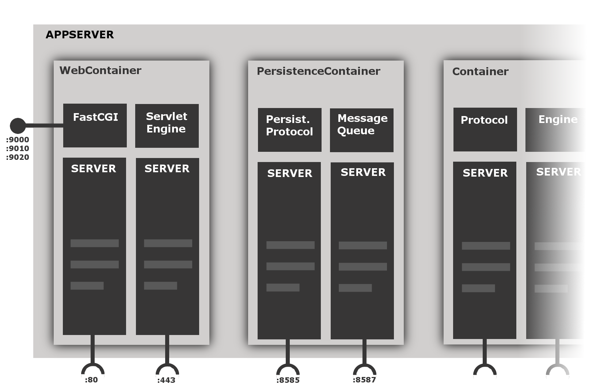

# Architecture

With threading technology we can build up a versatile, component based and scaleable environment.
To structure this environment we use certain terms which represent specialized classes for building up component blocks, handling external communication or do the actual work. ;)
These components are:

## Container
The container bundels the component we will mention next, *server*, into logical building blocks.
It acts a context for those servers as a server listening on port 80 and one listening on port 443 might
be bundeld into a `WebContainer` (which they actually are, together with a WebSocketServer).
Container allow for distributed installations as different container can interact in between different appserver installations.
So a container is a logical, distributable component bundeling different servers.

## Server
A server is the work-horse of the appserver. It contains a framework to handle parallel connections and process the requests comming over this connection. It will open a port and distribute the incomming connections on different thread where modules do the actual work on the request data.
You might think of a server as a more generally usable webserver like Apache or nginx.
Such a webserver would be what we call a server + an implementation of the HTTP protocol.
A bare server is agnostic to the type of connection or what to do with a request, it just allows work to be done in a distributed, scaleable manner.

## Protocol
A protocol enables a server to to work with a certain kind of connection. Just how a HTTP protocol implementation (have a look at [ours](<https://github.com/techdivision/TechDivision_Http>)) enables the server to understand HTTP, a [protocol for connections to the PersitenceContainer](<https://github.com/techdivision/TechDivision_PersistenceContainerProtocol>) enables the server component to handle requests of that type as well.

## Engine
[Here](<#server>) we briefly mentioned modules as components which acutally work on the request's data.
These modules are basically the same as they are for the Apache Webserver. They are passed by the request like a filter chain and do bits of work on it.
Is there more to do than simply processing some string data or handling a header we have engines for the heavy lifting.
The are triggered by a server module and can completely take over the processing as being wrapped within the moduel chain of the server. 
A good example is the [ServletEngine](<https://github.com/techdivision/TechDivision_ServletEngine>).
[Servlets](<http://en.wikipedia.org/wiki/Servlet>) are too complex to be handled within a module.
Therefore we query the engine which wraps the request and takes work over.
Something which can be considered another (but external) "engine" are [FastCGI](<http://en.wikipedia.org/wiki/FastCGI>) backends we can query within a module chain.

An overview of how this building blocks can form a multi-service architecture is given below.
It shows a basic setup of services one might want to use within a web environment.
